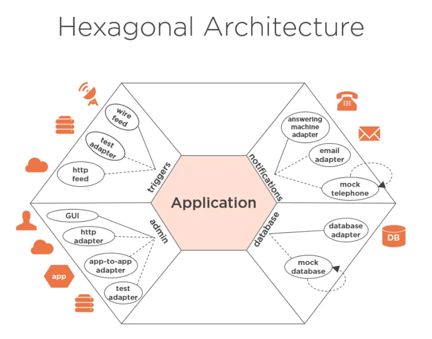
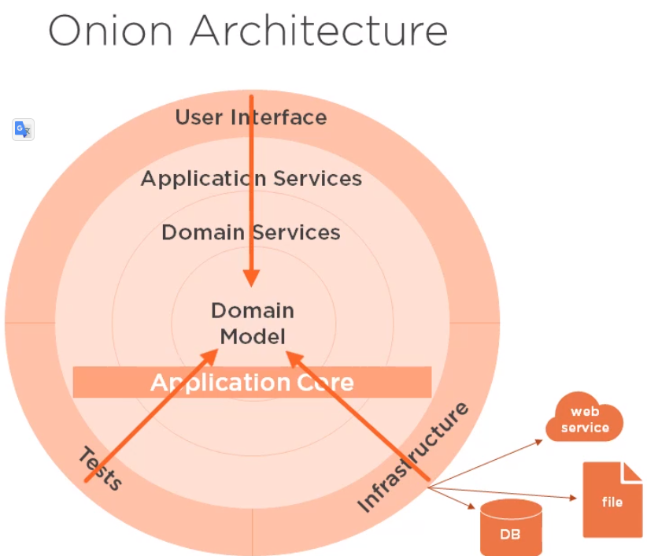
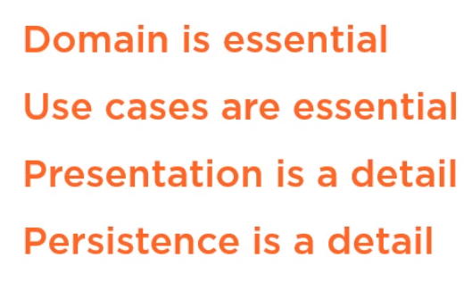
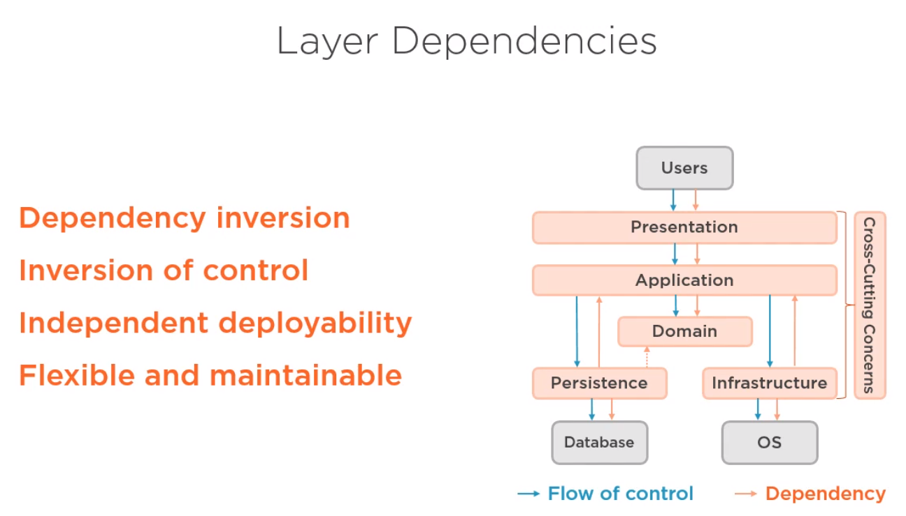
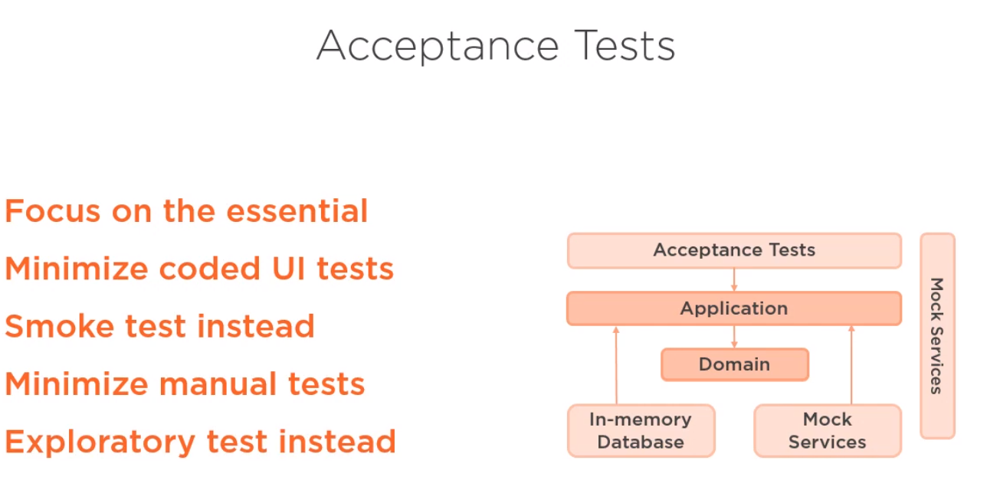

## Clean Architecture 2.0

Clean Architecture is a philosophy of architectural essentialism. It is about focusing on what is truly essential to the software' architecture versus what is just an implementation detail. 

## The Tradicional Architecture - Three-Layer Architecture
In this Architecture the key feature is that the user interface, business logic, and data access layer revolve around the database.

## Domain-Centric Architecture
In this architecture the domain is essential rather than the database.  

Why one took the place of the other? Because the perspective changed, now the plan locks for the domain business, it is essencial, instead of be concerned with wich plataform of data storage we should use.

### Hexagonal Architecture

### Onion Architecture

### Clean Architecture

### What is Essential and What is Detail?

## Four Layer Architecture - A Modern Architecture for the Three Layer Arch
 * Presentation Layer:  It provides for the user with an interface into the application 
 * Application Layer: It embeds the use cases of the system as executable code and abstraction
 * Domain Layer: It contains the domain logic of the system
 * Persistence/Intrastruceture: Provides for the system access to a database

##  Application Layer
- **Implements use cases** as executable code
	- Example: Customer searchs for products, add their to the cart and pays with credit card. 
- High-level application logic
- Knowledge about the **domain**  
- No knowledge about of the other layers - No dependencies on the outer layer of the application
- Application layer contains interfaces for its dependencies that these respective outer layers then implement.
	- **IoC** is used to wire up all the interfaces and their implementation  at runtime

## Command-Query Separation
### Command
A command does something. It means that a command should modify the state of the system, but it should not return a value;

### Query
A query answers a question, which means that it should not modify the state of the system, but should return a value

## Functional Organization
The structural organization of the project must follow functional cohesion
> The Architecture should scream the intent of the system by Robert C. Martin
categorical cohesion
### Structure Organization - By  Component vs By UseCases

**What makes more sense?**
Store silverware forks next to pitch forks and tuning fork just because they'are all three forks of some kind **OR** Store forks next to knives and spoons because all of them are used together when eat - Example By Matthew Renze

## Microservices - Overview

### Here to Divide the Boundaries of Microservices
- **Microservices per Aggregate Root**
> An AGGREGATE is a cluster of associated objects that we treat as a unit for the purpose of data changes. Each AGGREGATE has a root and a boundary. The boundary defines what is inside the AGGREGATE. The root is a single, specific ENTITY contained in the AGGREGATE.
> The root is the only member of the AGGREGATE that outside objects are allowed to hold references to[.]

In this approach, there is a microservice for each aggregate root within each bounded context and all the microservices share the same database for the respective bounded context.

- **Database Per Bounded Context**

## Testable Architecture

By using Clean Architecture the components such as usecases, domain business logic are easier to test and maintain these tests.

Due to the separation provided by using clean architecture, it is straightforward to test the business logic of the application without having to setup any framework or library.  It can write simple unit tests to test the complex business logic in our application without having to deal with the frameworks. Also, there is no need to have to change these tests when we change something in a framework. Of course, integration tests still important to ensure that everything is wired up correctly, but these costly tests will only be a few and will not increase when the complexity in our business logic is increased.

### Smoke Test
A smoke test may address basic questions like "does the program run?", "does the user interface open?", or "does clicking the main button do anything?" The process of smoke testing aims to determine whether the application is so badly broken as to make further immediate testing unnecessary. 

>Smoke tests broadly cover product features in a limited time [...] if key features don't work or if key bugs haven't yet been fixed, your team won't waste further time installing or testing. From Lessons Learned in Software Testing
