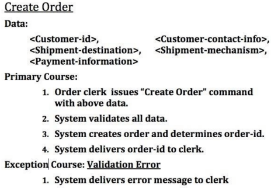

# ITkonekt 2019 | Clean Architecture and Design by Robert C. Martin (Uncle Bob) 

- Use cases are a simple description of one requirement. Specify input data, but there is no detailed information about it (high level abstraction). 

- Use case is an object, we can write the code for it, "abstract" code. ( Ivar Jacobson, Object-Oriented Software Engineering: A Use Case Driven Approach)

- The object that represent use case are called "iteractor". This kind of object have application specific business rules. (controll objects is the name that Jacobson gave for these objects).

There is two types of business rules:
1. Entity: Business rules that have nothing todo with automation. Business rules that the business would still use even if there are no computer. Application independent business rules.
2. Use Case: Business rules that are all about the automation.

- Boundaries Interfaces: In order get data in and out of the "use cases" lets work with boundaries.
  - Open arrow is a using relationship; 
    - OUTPUT BOUNDARY, this boundary is used by the interactor to delivery data;
  - Closed arrow is an inheritance relationship;   
    - INPUT BOUNDARY, accept data in and this boundary would be implemented by the interactor;