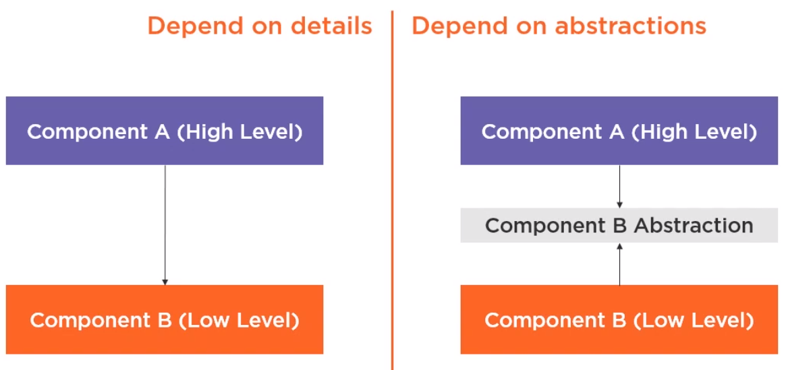
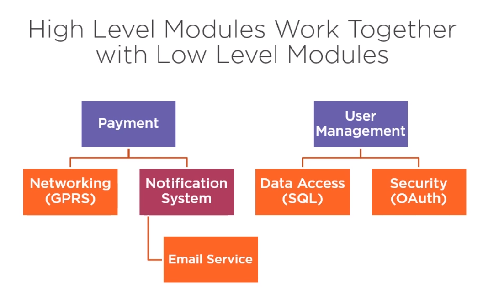

# Design Principles
Improving quality, design and maintainability with Design Principles

**Code Fragility** by Robert C. Martin
> Fragility is the tendency of the sw to break in many places every time it is changed

**Code Rigidity** by Robert C. Martin
> Rigidity is the tendency for software to be difficult to change, even in simple ways. Every change causes a cascade of subsequent changes in dependent modules

# SOLID Principles

## Single Responsibility Principal
**Definition:**  There should not be more than one reason for a class to change, or  **a class should always handle single functionality**.

**Main goal:**  To avoid introducing coupling between functionalities, because there is a chance of breaking coupled functionality when changes are made in o of them. That will require another round of testing to avoid any surprise on the production environment.

## Open/Closed Principle

**Definition:**  Classes, methods or functions should be Open tofor extension (new functionality) and Closed tofor modification.  
**ain goal:**  o prevent someone from changing already tried and tested code and allows the system to be open  extension through the use of inheritance, or interfaces. The main idea of this principle is to keep existing code from breaking when you implement new features.

**What does Open to Extension mean?**
This statement means that when a class is been designed the ideia of that new funcionalities can be added as new requirements are generated must be considered. 

**What does Closed to Modification mean?**
The statement **closed to extension** means that once a class is developed and tested this class should not be modified anymore, exept to correct bugs.

Generally extension can be achieved by using abstractions for dependencies, such as abstract classes and interfaces rather than using concrete classes.


## Liskov Substitution Principle

When extending a class, the subclass (the one which inherits a base class), should be able to be passed in place of objects of
the parent class without breaking the client code. Meaning that the subclass should remain compatible with the behavior of the superclass. 

**Don't ask if some class "is a" other class, Instead prefer ask _Does the classA fully substitute the classB _**

**One Use Very Important of Liskov Substitution Principle**
This concept  is critical when developing libraries and frameworks because the classes are going to be used by other people whose code cannot directly be accessed and changed.

### Liskov Substitution Requirements
* **A subclass shouldn’t strengthen pre-conditions**
A subclass shouldn’t strengthen pre-conditions. A precondition of a class is a rule that must be in place before an action can be taken.
**Example:**  Before calling a method that reads from a database you may need to satisfy the precondition that the database connection is open. If the subclass add more conditions, there is a viollation of the principle

* **Postconditions cannot be weakened in subclasses.s**
Postconditions describe the state of objects after a process is completed. 
**Example:**  After calling a method that reads from a database it may be assumed that the database connection is closed after executing a SQL statement. If the subclass remove the condition of close the database conection by assuming that it will be closed by something else, there is a viollation of the principle.

* **Invariants of a superclass must be preserved**
Invariant conditions that exist in the base class, must also remain invariant in the subclass. Since invariant conditions are expected to be immutable, the subclass should not change them as it may cause a side effect in the behaviours of the base class or the program. Invariants can be described as:
	> "A condition of a process that is true before the process begins and remains true afterwards" [font](http://www.blackwasp.co.uk/lsp.aspx)

	**Example:** Consider a class that has a method to handle files. If the method handles the process to open and close a file, an invariant may be that the file is not open befor the call of this respective method.

* **Immutable characteristics of a base class must not be changed by the subclass**
An subclass inherits methods and properties of its superclasses. The **immutable characteristc** constraint says that new or modified members should not modify the state of an object in a manner that would not be permitted by the base class. For example, if the base class represents an object with a fixed size, the subclass should not permit this size to be modified.

* **The subclasses should not throw exceptions that are not thrown by the base class**
types of exceptions should match or be subtypes of the ones that the base method is already able to throw. 

**Contextualizingwith an Example - By Uncle Bob**
> In mathematics, a **Square** is a **Rectangle**. Indeed it is a specialization of a rectangle. The **"is a"** makes you want to model this with inheritance. However if in code you made **Square** derive from **Rectangle**, then a **Square** should be usable anywhere you expect a **Rectangle**. This makes for some strange behavior.

> Imagine you had **SetWidth** and **SetHeight** methods on your **Rectangle** base class; this seems perfectly logical. However if your **Rectangle** reference pointed to a **Square**, then **SetWidth** and **SetHeight** doesn't make sense because setting one would change the other to match it. In this case **Square** fails the Liskov Substitution Test with Rectangle and the abstraction of having Square inheriting from Rectangle is a bad one.

**Comments** - Requirements this example does not respect
	*  A subclass shouldn’t strengthen pre-conditions, because if you set a **Square**, immediatly you are saying that witdth and height must be the same, and it is not considered by the superclass, thus here we have a viollation.

### Exemplos of non-adherence of Liskov Substitution Principle

#### Verify for a specific type 
The below code snippet receives a set of taks and set the status of each of them to "in progress", except for bug fix that must first be initialized before assuming any status;

```java
for (Taks t: tasks){
	if(t instanceof BugFix){
		BugFix bf = (BugFix) t;
		bf.initializeBugDescription();
	}
    t.setInProgress();
}
```

This kind of approach where for most subtypes, one thing is done, but for particular subtypes something else must be performed. It indicates that the subtypes cannot be fully replace by its base class. In this situation inheritance are not been used properly 

**Solution:** Apply the principle "tell, don't ask"
```java
Class BugFix Extends Taks {
	
	@Override
	public void setInProgress()
    	this.initializeBugDescription();
	    super;setInProgress();

} 

// new for loop
for (Taks t: tasks){
    t.setInProgress();
}

```

## Interface Segregation Principle
The principle Interface Segregation states that **a class should not be forced to depend on methods it does not use**. Meaning that any classes that implement an interface, should not have "dummy" implementations of any methods defined in the interface. Instead, **large interfaces should be splited into smaller generalizations**. If it is not possible use the design pattern Adapter.

* A class should not be forced to depend on methods it does not use
* Interfaces should be split up in such a way that it can properly describe the separate functionalities of your system


## Dependency Inversion Principle
This principle states that high level modules should depend on high level generalizations, and not on low level details. Meaning that classes if will there dependencies they should depend on a interface or abstract class rathar than concreate classes. If clients are dependent on higher-level generalizations then low level implementations can be changed or replaced with more ease later on. This is a form of looser coupling.

**Summary**
A. Higher-level modules should not depend on low-level modules. Both should depend on abstractions.
B. Abstractions should not depend on details. Details should depend on abstractions.

Also, dependency inversion helps in the generalization of the behavior of your concrete classes into abstract classes and interfaces.



What are High Level Modules?
* Modules written to solve real problems and use cases
* they are more abstract and **map to the business domain** -> business logic
* These modules tell us "What the software should do"

What are Low Level Modules?
* Contain implementation details that are required to execute the business policies.
* They are considered the "plumbing" of an application
* These modules tell us "How the software should do various taks"




High level and low level modules are always relative to one another. For example, It we take "payment" as the high level model the low level model for this component is "notification system"; and for "notification system" the low level module is "email service". These relationships always depend on what is the referential

### Dependency Injection
Dependency Injection is the **technique** that allows the creation of dependent objects outside of a class and provides those objects to a class

### Inversion of Control (IoC)
**Inversion of control is a design principle in which the control of objects creation, configuration, and lifecycle is passed to a container or framework.**

IoC helps deal with a problem that can be seen by using the technique Dependency Injection. Creating dependencies manually in order to instanciate a component is not scalable. This is where the IoC comes in. It can handle the creation and the lifecycle of all objects in an application.

**It is no longer necessary create new objects with "new", they are created by "something else" (IoC container).** -> Heavy use of frameworks to perform these actions

**Benefits**
* makes easy to switch between different implementations at runtime
* increased program modularity
* Manages the lifecycle of objects and their configuration

## References
http://www.blackwasp.co.uk/lsp.aspx
https://stackoverflow.com/questions/56860/what-is-an-example-of-the-liskov-substitution-principle

